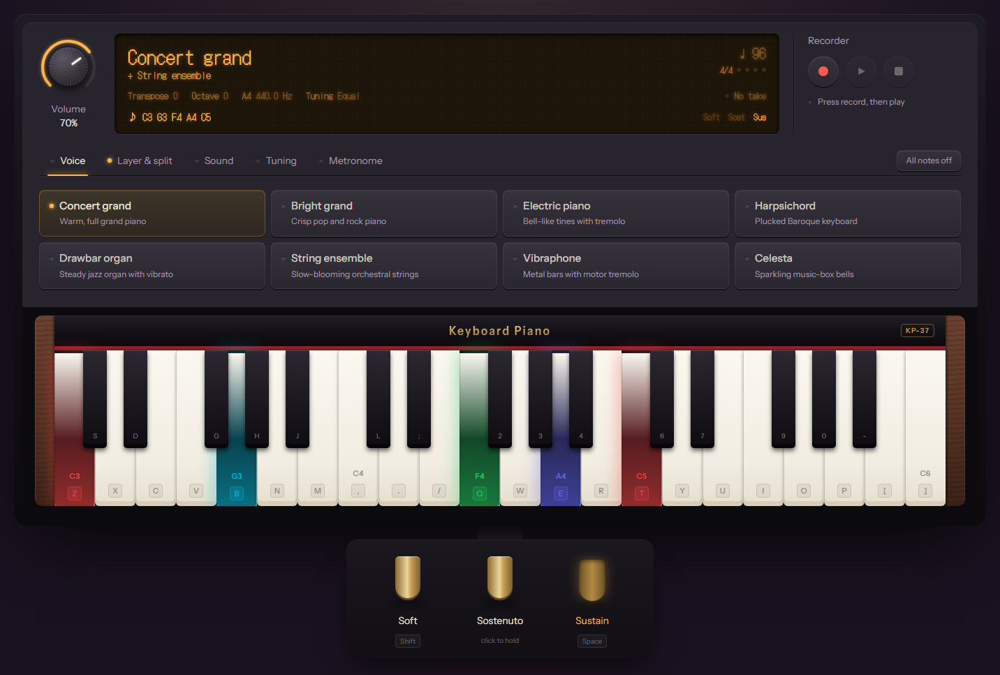
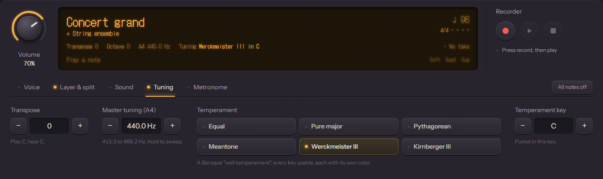

<div align="center">

# Keyboard Piano

**A 37-key digital piano for your computer keyboard, synthesized live in the browser.**

Eight voices, layer and split modes, three pedals, historical tunings, a metronome and a recorder.<br/>
No audio files: every note is generated in real time with the Web Audio API.

[](https://github.com/satyaidk/expert-eureka/actions/workflows/ci.yml)


[Getting started](#getting-started) · [Features](#features) · [How to play](#how-to-play) · [Architecture](#architecture) · [Documentation](#documentation)

<!-- After deploying, add:  **[▶ Play it live](https://your-app.vercel.app)** -->



</div>

---

## Overview

Keyboard Piano turns all four letter and number rows of your keyboard into a piano shaped like the real thing. Each pair of rows is a strip of white keys with black keys above, so the bottom rows play **C3–E4** and the top rows continue to **C6**.

It recreates the functions of real digital pianos (Yamaha Clavinova, Roland FP-30X), researched from their manuals: voices, layer and split, sustain/sostenuto/soft pedals, touch sensitivity, reverb, transpose, master tuning and historical temperaments, plus a metronome and a performance recorder. The interface is designed as the instrument itself: a backlit LCD, knobs, LED pads, a lacquered fallboard and brass pedals.

The project is built the way production software is: a layered architecture, 257 automated tests, CI on every push, and full documentation including 12 Architecture Decision Records.

## Features

| | Feature | Details |
| --- | --- | --- |
| | **37-key keyboard** | Two piano-shaped manuals on the computer keyboard; mouse and multi-touch; octave shift to reach C1–C8 |
| | **8 voices** | Concert grand, Bright grand, Electric piano, Harpsichord, Drawbar organ, String ensemble, Vibraphone, Celesta |
| | **Layer & split** | Two voices on every key with a balance knob, or a separate left-hand voice with a movable split point |
| | **Three pedals** | Soft (una corda), sostenuto and sustain, with the real-piano rules |
| | **Touch sensitivity** | Light / Medium / Heavy / Fixed; mouse and touch velocity from press position |
| | **Reverb & brilliance** | Room, concert hall or cathedral with depth; mellow, normal or bright tone |
| | **Tuning** | Transpose ±12, master tuning A4 = 415.3–466.2 Hz, six temperaments (Equal, Pure major, Pythagorean, Meantone, Werckmeister III, Kirnberger III) in any key |
| | **Metronome** | 30–240 BPM, 2/4 to 6/8 with accents, tap tempo, sample-accurate timing |
| | **Recorder** | Record a take and play it back through the instrument, keys lighting up |
| | **Notes** | Famous riffs (Tokyo Drift, Lean On, Taki Taki, Megalovania, Für Elise…) loop on the keyboard until you stop them, at 50–125% speed |
| | **Visual feedback** | Every note has its own color; sustained notes glow softly; the LCD shows what's sounding |
| | **Accessible** | Screen-reader labels, keyboard-operable controls (radio groups, tabs, sliders), reduced-motion support |

### Sound engine

Every voice is synthesized from a data-driven recipe:

- **Additive synthesis** with up to 8 partials, plus **string inharmonicity** for the pianos
- **FM synthesis** for the electric piano's bell-like attack
- **LFO vibrato and tremolo**, hammer and pluck **noise transients**
- **Natural decay** while keys are held (higher notes fade faster), **velocity-dependent brightness**
- **Convolution reverb** with generated impulse responses, a high-shelf **brilliance** EQ, stereo spread
- **64-voice polyphony** with voice stealing and a master compressor

<div align="center">

</div>

## Getting started

**Prerequisites:** [Node.js](https://nodejs.org) 22.12 or newer.

```bash
git clone https://github.com/satyaidk/expert-eureka.git
cd expert-eureka
npm install
npm run dev
```

Open **http://localhost:3000** and press a key. Browsers allow sound only after you interact with the page, so audio starts on your first key press or click.

## How to play

### Notes

```
 Upper manual: F4 → C6
   2   3   4       6   7       9   0   -         black keys
 Q   W   E   R   T   Y   U   I   O   P   [   ]   white keys

 Lower manual: C3 → E4
   S   D       G   H   J       L   ;             black keys
 Z   X   C   V   B   N   M   ,   .   /           white keys
```

### Shortcuts

| Keys | Action |
| --- | --- |
| `←` `→` | Octave down / up |
| `↑` `↓` | Transpose down / up a semitone |
| `Space` (hold) | Sustain pedal |
| `Shift` (hold) | Soft pedal |

Everything else (voices, modes, effects, tuning, metronome, recorder and the sostenuto pedal) is on screen.

## Architecture

```
UI components  ──►  React hooks  ──►  core library (plain TypeScript)  ──►  Web Audio API
src/components      src/hooks         src/lib/music · src/lib/audio
```

Each layer depends only on the layers below it, so the music and audio core is framework-free and directly testable. Highlights:

- **Pedal logic as a pure state machine** (`NoteTracker`) that returns decisions; React and audio act on them
- **Data-driven voices**: adding an instrument means adding a recipe object
- **Lookahead scheduling** keeps the metronome on the audio clock, immune to UI jank
- **Physical key mapping** (`KeyboardEvent.code`) with layout-aware labels via the Keyboard Map API
- **A hardware-style design system** of accessible primitives: Knob, Stepper, SegmentedControl, RadioPads, PadButton, Led

Read the full [architecture guide](docs/architecture.md).

## Tech stack

| Area | Technology |
| --- | --- |
| Framework | [Next.js 16](https://nextjs.org) (App Router, static pre-rendering) |
| UI | [React 19](https://react.dev), [Tailwind CSS 4](https://tailwindcss.com), [Framer Motion](https://motion.dev) |
| Language | [TypeScript](https://www.typescriptlang.org) (strict) |
| Audio | [Web Audio API](https://developer.mozilla.org/docs/Web/API/Web_Audio_API) |
| Testing | [Vitest](https://vitest.dev), [React Testing Library](https://testing-library.com), a custom fake Web Audio API |
| CI | GitHub Actions: lint, type-check, test, build |

## Project structure

```
src/
├── app/                  # Next.js route, layout, design tokens, icon
├── components/
│   ├── PianoApp.tsx      # Client root: wires the hooks, lays out the instrument
│   ├── console/          # Control panel: LCD, recorder, function tabs and pages
│   ├── piano/            # Keyboard, keys, pedals
│   └── ui/               # Design-system primitives
├── hooks/                # usePiano, useAudioEngine, useMetronome, useRecorder, useLooper, …
├── lib/
│   ├── music/            # Notes, keyboard map, tuning and temperaments, song loops
│   ├── audio/            # Engine, voice synthesis, voices, effects, metronome
│   └── note-tracker.ts   # Pedal rules (pure state machine)
├── test/                 # Test setup and fake Web Audio API
└── types/                # Shared domain types
docs/                     # Architecture, concepts, code walkthrough, ADRs, guides
```

## Scripts

| Command | Description |
| --- | --- |
| `npm run dev` | Start the development server |
| `npm run build` | Create a production build |
| `npm start` | Serve the production build |
| `npm run lint` | Run ESLint |
| `npm run typecheck` | Type-check with TypeScript |
| `npm test` | Run the test suite once |
| `npm run test:watch` | Run tests in watch mode |
| `npm run validate` | Lint, type-check, test and build (the same checks as CI) |

## Testing

257 unit and integration tests cover the music math, synthesis graph, pedal rules, metronome and loop scheduling, recorder, hooks and UI components. Audio is tested against a hand-written **fake Web Audio API** that records every node, connection and scheduled value; time-based code uses fake clocks and timers.

```bash
npm test
```

See the [testing guide](docs/testing.md).

## Documentation

The [`docs/`](docs/README.md) folder explains the project from the big picture down to every file:

| Guide | What's inside |
| --- | --- |
| [Digital piano functions](docs/concepts/piano-functions.md) | What each feature does on a real piano, with sources |
| [Architecture](docs/architecture.md) | Layers, data flow, state, audio graph, design system |
| [Music theory](docs/concepts/music-theory.md) · [Web Audio](docs/concepts/web-audio.md) · [React patterns](docs/concepts/react-patterns.md) | The concepts behind the code |
| [Code walkthrough](docs/code-walkthrough/) | Every file explained, in seven parts |
| [Decision records](docs/decisions/) | 12 ADRs: why key choices were made |
| [Testing](docs/testing.md) · [Development](docs/development.md) · [Roadmap](docs/roadmap.md) | Working on the project |

## Roadmap

Saved settings, MIDI keyboard input, chord detection on the LCD, MIDI file export, damper resonance, and Playwright end-to-end tests. See the [roadmap](docs/roadmap.md).

## Contributing

1. Create a branch from `dev` (`feat/…`, `fix/…`)
2. Make your change with tests; update the docs
3. Run `npm run validate`
4. Open a pull request into `dev` using [Conventional Commits](https://www.conventionalcommits.org)

Details in the [development guide](docs/development.md).

## Acknowledgements

- Chris Wilson, [*A Tale of Two Clocks*](https://web.dev/articles/audio-scheduling): the metronome's scheduling technique
- Yamaha and Roland owner's manuals: the functions and value ranges of real digital pianos
- Historical temperament tables from [Wikipedia](https://en.wikipedia.org/wiki/Werckmeister_temperament) and standard just-intonation ratios

See the [changelog](CHANGELOG.md) for release history.
