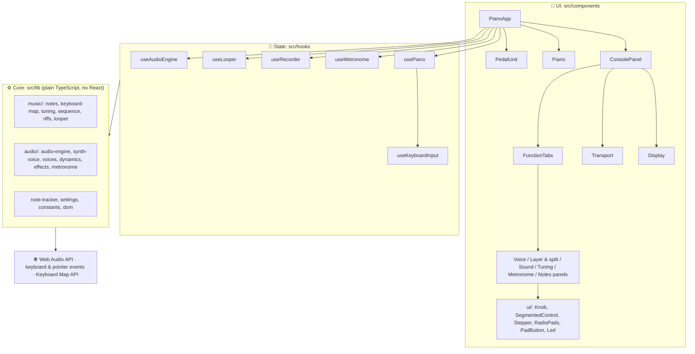
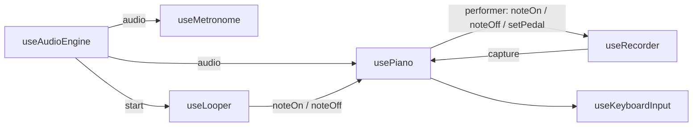
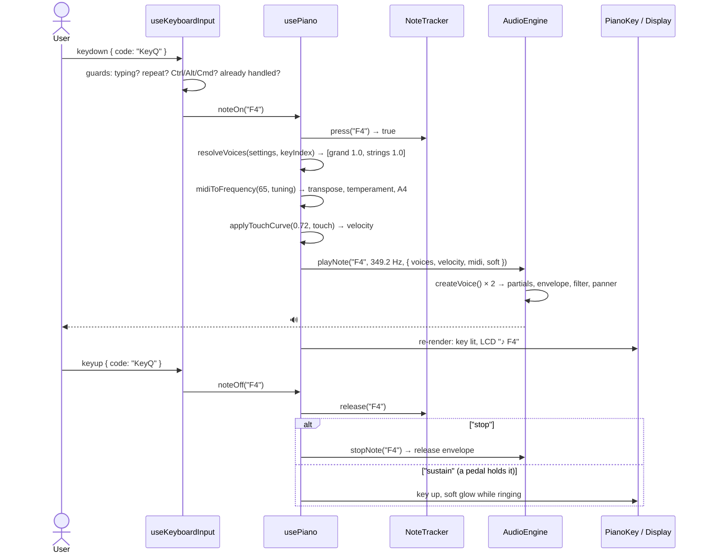
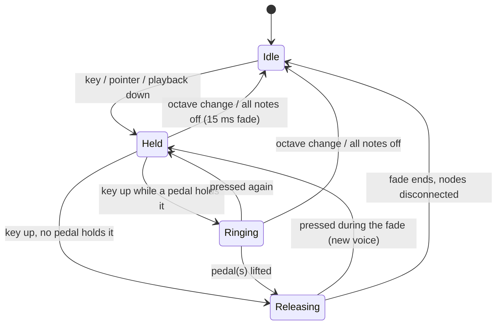
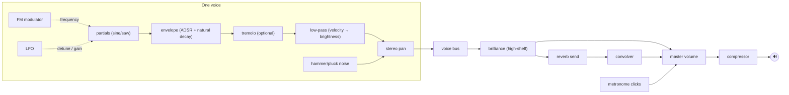

# Architecture

How Keyboard Piano is put together: the layers, how a key press becomes sound, where state lives, and why it's designed this way. Read this before the [code walkthrough](./code-walkthrough/) so each file has a place in your head.

---

## 1. What the app does

A browser-based **digital piano** with the functions of a real one:

- **37 keys (C3–C6)** on all four letter/number rows of the computer keyboard, plus mouse and multi-touch
- **8 synthesized voices**, **Layer** and **Split** modes
- **Three pedals**: soft, sostenuto, sustain
- **Touch sensitivity**, **reverb**, **brilliance**
- **Transpose**, **master tuning** (A4 415.3–466.2 Hz) and **6 temperaments**
- **Metronome** with tap tempo, and a **recorder**
- **Notes page**: famous riffs that loop on the keyboard until stopped, keys lighting up as they play
- A hardware-style interface: LCD display, knobs, pads with LEDs, a fallboard and brass pedals

What each function means on a real piano: [Digital piano functions](./concepts/piano-functions.md).

## 2. Tech stack

| Technology | Version | Why |
| --- | --- | --- |
| Next.js (App Router) | 16 | Routing, static pre-rendering, fonts, metadata, production builds |
| React | 19 | Components and hooks |
| TypeScript (strict) | 5 | Compile-time safety; types document every data shape |
| Tailwind CSS | 4 | Utility styling with design tokens defined in CSS |
| Framer Motion | 14 | Spring and layout animations |
| Web Audio API | browser | Real-time synthesis, effects and scheduling |
| Vitest + Testing Library | 5 / 16 | 257 unit and integration tests |
| GitHub Actions | | CI: lint, type-check, test, build |

## 3. Layered design

Each layer only depends on the layers below it.



| Layer | Knows about | Doesn't know about |
| --- | --- | --- |
| **UI** (`components/`) | Props, hooks, styling | How sound is made |
| **State** (`hooks/`) | React state, events, the engine's API | Pixels and layout |
| **Core** (`lib/`) | Music math, synthesis, pedal rules | React |
| **Types** (`types/`) | Shared data shapes | Behavior |

**Why it matters:**

- **Testable.** 157 of the 257 tests exercise `lib/` directly, with no rendering.
- **Replaceable.** A sample-based engine could replace the synthesizer without touching a component.
- **Navigable.** Sound wrong? Look in `lib/audio`. Looks wrong? `components/`. Pedals behaving oddly? `note-tracker.ts`.

## 4. Folder structure

```
src/
├── app/                      # Next.js route: layout, page, global styles/tokens, icon
├── components/
│   ├── PianoApp.tsx          # Client root: creates the hooks, lays out the cabinet
│   ├── KeyGuide.tsx          # Which computer keys do what
│   ├── console/              # Control panel
│   │   ├── ConsolePanel.tsx  # Container: volume, display, recorder, function tabs
│   │   ├── Display.tsx       # Dot-matrix LCD readout
│   │   ├── Transport.tsx     # Record / play / stop
│   │   ├── FunctionTabs.tsx  # Accessible tabs with LED indicators
│   │   └── panels/           # Voice, LayerSplit, Sound, Tuning, Metronome, Notes
│   ├── piano/                # Piano (keys, fallboard, cheeks), PianoKey, PedalUnit
│   ├── ui/                   # Design-system primitives: Knob, SegmentedControl, Stepper, RadioPads, PadButton, Led, Field
│   └── layout/               # MotionProvider
├── hooks/                    # usePiano, useAudioEngine, useKeyboardInput, useKeyboardLabels, useMetronome, useRecorder, useLooper
├── lib/
│   ├── music/                # notes, keyboard-map, tuning, sequence (melody format), riffs (song library), looper
│   ├── audio/                # audio-engine, synth-voice, voices, dynamics, effects, metronome
│   ├── note-tracker.ts       # Held/ringing notes + sustain/sostenuto rules
│   ├── settings.ts           # Defaults + validation
│   ├── constants.ts          # Every tunable number
│   └── dom.ts                # isTypingTarget
├── test/                     # Test setup + fake Web Audio API
└── types/                    # Shared domain types
```

Tests sit next to the code they test (`tuning.ts` → `tuning.test.ts`).

## 5. Server vs Client Components

`app/layout.tsx` and `app/page.tsx` are **Server Components**: static HTML, pre-rendered at build time (`○ Static`). Everything interactive lives under the client island `<PianoApp />`, plus the tiny `MotionProvider`.

## 6. How the hooks fit together



- `useAudioEngine` owns the single `AudioEngine`; piano and metronome share it
- `usePiano` reports every note/pedal action through `onPerformanceAction`; the recorder captures them while recording
- On playback, the recorder drives the piano through the same `noteOn`/`noteOff`/`setPedal` calls a user would trigger, so keys light up during playback
- The looper (Notes page) does the same with riffs, booking each note on a fixed timeline so the loop never drifts ([ADR 0012](./decisions/0012-loop-riffs-through-the-piano.md))

## 7. Data flow: a key press becomes sound

Pressing **Q** (F4) with Layer mode on:



Mouse, touch and recorder playback call the same `noteOn`/`noteOff`. **There is one code path for starting a note**, whatever the input.

## 8. Where state lives

| State | Lives in | Why there |
| --- | --- | --- |
| Settings (voice, mode, tuning, effects…) | `usePiano`: `useState` + `settingsRef` | UI re-renders; handlers need the latest value synchronously |
| Held / ringing notes | `NoteTracker` instance (mirrored to state) | Pure rules, testable without React |
| Pedal sources (keyboard / screen / playback) | `usePiano`: `pedalSourcesRef` | A pedal is down while *any* source holds it |
| Physical key → note started | `useKeyboardInput`: `useRef<Map>` | Only handlers need it |
| Audio voices | `AudioEngine` (private maps) | Audio objects aren't UI state |
| Metronome tempo, beat | `useMetronome` | Drives the panel and LCD beat lights |
| Recording events | `useRecorder`: ref | Large, never rendered directly |
| Selected riff, speed, playing | `useLooper` | Drives the Notes page and its tab LED |
| Booked loop timers, keys the loop holds | `Looper` instance (private) | Timing rules, testable without React |

### Note lifecycle



### Pedal sources

Space (keyboard) is momentary; the on-screen pedal latches; recorder playback presses pedals too. Each is a **source**, and a pedal is down while any source holds it. So lifting Space doesn't release a pedal you latched on screen.

## 9. The audio graph



Details: [Web Audio concepts](./concepts/web-audio.md).

## 10. Input handling rules

Two kinds of `window` listeners: **notes** (`useKeyboardInput`) and **controls** (`usePiano`: arrows, Space, Shift). Both apply the same rules:

| Situation | Behavior | Why |
| --- | --- | --- |
| Typing in a text field | Ignored | Don't play notes while typing |
| Focus on a knob, slider or radio group | Arrows go to the control | Controls `preventDefault()`; global listeners skip `defaultPrevented` events |
| Ctrl / Alt / Cmd held | Ignored | Keep browser shortcuts working |
| Auto-repeat | Ignored | One press, one note |
| Shift held (soft pedal) | Notes still play | Matched by physical `event.code`, not the character |
| Octave changed mid-press | Key-up stops the right note | Each key remembers the note it started |
| Window loses focus | Keys and keyboard pedals released | The browser never sends their keyup |
| Space on a keyboard-focused button | The button gets it | Standard accessibility |

## 11. Interface design system

The UI is designed as **the instrument seen from the bench** ([ADR 0011](./decisions/0011-instrument-as-interface.md)): a plum-velvet stage, satin-ebony cabinet, graphite control surface, walnut cheeks, red felt, brass pedals and an amber LCD. Tokens live in `app/globals.css` as CSS variables, exposed to Tailwind through `@theme inline` (`bg-panel`, `text-led`, `font-lcd`…).

| Token | Value | Used for |
| --- | --- | --- |
| `--stage` | `#1a1220` | Page background |
| `--panel` | `#26232c` | Control surface |
| `--led` | `#ffb547` | LCD text, LEDs, focus ring, active states |
| `--walnut`, `--felt`, `--brass` | | Cheeks, key felt, pedals |

**Type:** Instrument Sans (UI and wordmark), DotGothic16 (LCD only).

**Restraint:** the only saturated color is the rainbow key lighting; everything else is quiet hardware. Panels have **fixed heights** on wide screens so the keyboard never jumps when you switch pages.

## 12. Performance

- `React.memo` on `PianoKey`: one key press re-renders one key
- Stable callbacks and a memoized `AudioControls` object
- Key sizes come from CSS `clamp()` variables, with zero JavaScript on resize
- Animations use `transform` and `opacity`; the power-on sweep is pure CSS
- Audio: impulse responses generated once and cached, nodes disconnected after use, 64-voice polyphony cap

## 13. Accessibility

- Every key is a labelled button (`aria-label="F#4"`, `aria-pressed`); keys are out of the Tab order because the mapped computer keys play them
- Real widgets: radio groups, tabs and sliders with roving tabindex and arrow keys
- The LCD's "now playing" line and step values are `aria-live`
- Amber `:focus-visible` ring everywhere; mouse clicks don't steal focus from the keyboard
- `MotionConfig reducedMotion="user"` plus CSS `prefers-reduced-motion` rules

## 14. Known limitations

- **Synthesized, not sampled.** Expressive, but not a concert-grand recording ([ADR 0001](./decisions/0001-synthesize-sound-instead-of-samples.md))
- **Computer keys have no velocity.** Touch curves still set their loudness; mouse/touch use press position
- **The sostenuto pedal has no key** (Shift and Space are taken by soft and sustain); it's on screen
- **Phones scroll the keyboard** rather than shrinking 37 keys below a tappable size ([ADR 0010](./decisions/0010-two-manual-37-key-layout.md))
- **Settings aren't saved** between visits yet ([roadmap](./roadmap.md))
- **Loops run on JavaScript timers**, not the audio clock, so a note can be a few ms late when the page is busy, and a loop restarts when you return to a background tab ([ADR 0012](./decisions/0012-loop-riffs-through-the-piano.md))
