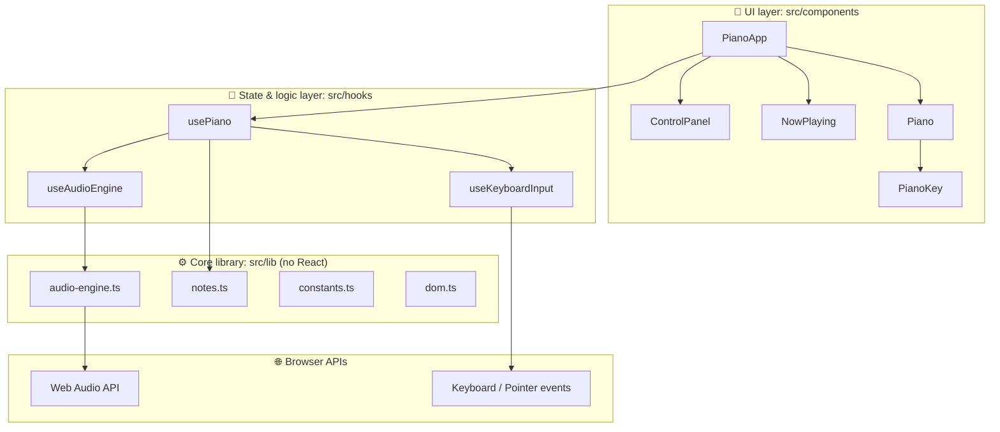
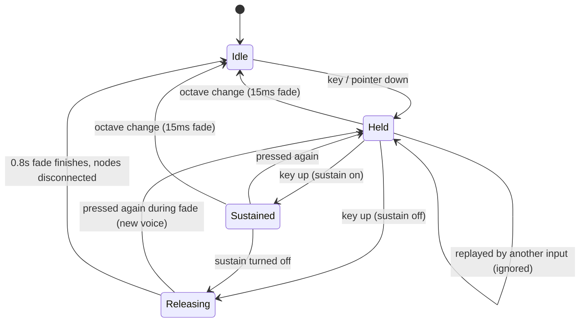
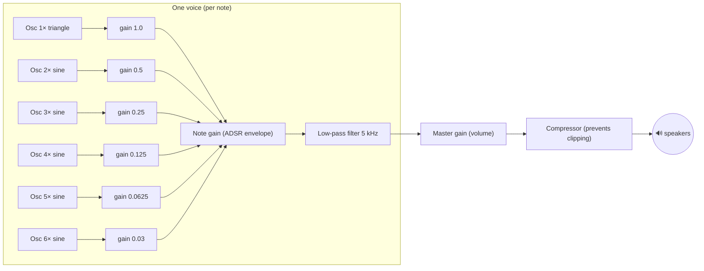

# Architecture

This document explains how Keyboard Piano is put together: the layers, how data flows when you press a key, where state lives, and why it's designed this way. Read it before the [code walkthrough](./code-walkthrough/) so each file has a place in your head.

---

## 1. What the app does

- Plays piano notes when you press keys on your computer keyboard, click with a mouse, or tap on a touch screen
- Synthesizes the sound in real time with the **Web Audio API**. No audio files are downloaded.
- Lights up each key in its own rainbow color while it plays
- Has controls for **volume**, **octave shift** (−2 to +2) and a **sustain pedal**
- Works on desktop and phones, respects "reduce motion", and is screen-reader labelled

## 2. Tech stack

| Technology | Version | Why it's used |
| --- | --- | --- |
| [Next.js](https://nextjs.org) (App Router) | 16 | React framework: routing, server rendering, fonts, metadata, production builds |
| [React](https://react.dev) | 19 | UI as components; hooks for state and side effects |
| [TypeScript](https://www.typescriptlang.org) | 5 | Catches mistakes at compile time and documents data shapes |
| [Tailwind CSS](https://tailwindcss.com) | 4 | Utility classes for fast, consistent styling |
| [Framer Motion](https://motion.dev) | 14 | Spring animations for key presses and entrances |
| [Web Audio API](https://developer.mozilla.org/docs/Web/API/Web_Audio_API) | browser | Generates sound with oscillators, gains and filters |
| [Vitest](https://vitest.dev) + [Testing Library](https://testing-library.com) | 5 / 16 | Unit and integration tests |
| GitHub Actions | — | CI: lint, type-check, test, build on every push |

## 3. Layered design

The code is split into layers. **Each layer only talks to the layer directly below it.** This is the most important idea in the codebase.



| Layer | Folder | Knows about | Does **not** know about |
| --- | --- | --- | --- |
| UI | `src/components` | Props, hooks, styling | Web Audio, how sound is made |
| State & logic | `src/hooks` | React state, events, the engine's API | Pixels, colors, layout |
| Core library | `src/lib` | Music math, Web Audio | React (plain TypeScript) |
| Types | `src/types` | Data shapes shared by all layers | Behavior |

**Why this matters:**

- **Testability.** `notes.ts` and `audio-engine.ts` are plain TypeScript, so they're tested without rendering any UI.
- **Replaceability.** You could swap the synthesized engine for real piano samples without touching a single component.
- **Readability.** When something is wrong with *sound*, you look in `lib/`. When it *looks* wrong, you look in `components/`.

This is called **separation of concerns**, and interviewers often ask about it.

## 4. Folder structure

```
keyboard-piano/
├── .github/workflows/ci.yml   # CI pipeline (lint → typecheck → test → build)
├── docs/                      # You are here
├── src/
│   ├── app/                   # Next.js App Router: the route and page shell
│   │   ├── layout.tsx         # <html>/<body>, fonts, metadata, MotionProvider
│   │   ├── page.tsx           # The "/" route: Header + PianoApp
│   │   ├── globals.css        # Tailwind import, theme tokens, background
│   │   └── icon.svg           # Browser tab icon
│   ├── components/
│   │   ├── PianoApp.tsx       # Client root: calls usePiano(), composes the UI
│   │   ├── layout/            # Page chrome: Header, MotionProvider
│   │   ├── piano/             # Keyboard: Piano, PianoKey, NowPlaying
│   │   └── controls/          # ControlPanel (volume, octave, sustain)
│   ├── hooks/                 # usePiano, useAudioEngine, useKeyboardInput
│   ├── lib/                   # audio-engine, notes, constants, dom (no React)
│   ├── test/                  # Test setup + fake Web Audio API
│   └── types/                 # Shared TypeScript interfaces
├── vitest.config.mts          # Test runner config
└── package.json               # Scripts and dependencies
```

Tests sit **next to the file they test** (`notes.ts` → `notes.test.ts`), so it's obvious which code is covered.

## 5. Server vs. Client Components

Next.js renders components on the **server** by default. Anything that needs browser features (state, event listeners, Web Audio, animations) must be a **Client Component**, marked with `'use client'` at the top of the file.

| File | Type | Why |
| --- | --- | --- |
| `app/layout.tsx` | Server | Static HTML shell, fonts, metadata |
| `app/page.tsx` | Server | Just arranges `Header` and `PianoApp` |
| `components/PianoApp.tsx` and everything below it | Client | Uses hooks, events, audio, animation |
| `components/layout/Header.tsx`, `MotionProvider.tsx` | Client | Framer Motion needs the browser |

The page stays a Server Component, and the interactive part is one "client island" (`PianoApp`). This keeps the client JavaScript bundle focused. The HTML for the whole page is still pre-rendered at build time (`○ (Static)` in the build output), so it appears instantly.

## 6. Data flow: what happens when you press a key

Here's the full journey of pressing **A** (which plays C4):

```mermaid
sequenceDiagram
    actor User
    participant Win as window (keydown)
    participant KI as useKeyboardInput
    participant P as usePiano
    participant AE as useAudioEngine
    participant E as AudioEngine
    participant WA as Web Audio
    participant UI as Piano / PianoKey

    User->>Win: presses "A"
    Win->>KI: KeyboardEvent { key: "a", code: "KeyA" }
    KI->>KI: guards: typing in a text field? repeat? Ctrl/Alt/Meta?
    KI->>KI: find note for "a" → C4, remember KeyA → C4
    KI->>P: onNoteStart("C4", 261.63)
    P->>AE: playNote("C4", 261.63)
    AE->>E: init() (first time only) + playNote()
    E->>WA: create 6 oscillators → gains → filter → master → compressor
    WA-->>User: 🔊 sound
    P->>P: heldRef.add("C4"); setActiveNoteIds({C4})
    P-->>UI: re-render with activeNoteIds
    UI-->>User: 🌈 key C4 glows and moves down

    User->>Win: releases "A"
    Win->>KI: keyup { code: "KeyA" }
    KI->>P: onNoteStop("C4")
    alt sustain OFF
        P->>E: stopNote("C4") → 0.8s release fade
    else sustain ON
        P->>P: move C4 to sustainedNoteIds (keeps ringing)
    end
    P-->>UI: re-render, key lifts
```

Mouse and touch follow the same path. `PianoKey` calls `onNoteStart(noteId)` on pointer down, and `usePiano` looks up the frequency and calls the same `handleNoteStart`. **There is exactly one code path for starting a note**, whatever the input.

## 7. Where state lives

State is deliberately split across three places, each chosen for a reason:

| State | Lives in | Type | Why there |
| --- | --- | --- | --- |
| Volume, octave shift, sustain on/off | `usePiano` | `useState` (`config`) | The UI must re-render when they change |
| Which notes are held / sustained | `usePiano` | `useRef` **and** `useState` | Refs give event handlers the latest value instantly; state triggers re-renders |
| Physical key → note mapping | `useKeyboardInput` | `useRef<Map>` | Only event handlers need it; it never affects rendering |
| Playing audio voices (oscillators, gains) | `AudioEngine` | private `Map` | Audio objects aren't UI state; React shouldn't own them |
| The `AudioEngine` instance | `useAudioEngine` | `useRef` | Must survive re-renders without causing them |

The "ref + mirrored state" pattern is explained in [ADR 0002](./decisions/0002-refs-plus-state-for-note-tracking.md).

### Note lifecycle

Every note moves through these states:



- **Held** → in `activeNoteIds`. The key looks pressed.
- **Sustained** → in `sustainedNoteIds`. The key is up but glows softly.
- **Releasing** → no longer tracked by React; the engine fades it out and then frees the audio nodes.

## 8. The audio graph

Each note is built from a small network of Web Audio nodes:



Voices are created when a note starts and torn down after it fades out. The master gain and compressor are created once and shared. The details are in [Web Audio concepts](./concepts/web-audio.md).

## 9. Input handling rules

Two `keydown` listeners are registered on `window`:

1. **`useKeyboardInput`** handles note keys (`A W S E D F T G Y H U J K O L P ;`)
2. **`usePiano`** handles control shortcuts (`Z`, `X`, `Space`)

Both apply the same guards so the piano behaves well on a real web page:

| Situation | Behavior | Why |
| --- | --- | --- |
| Typing in a text field | Ignored | Don't play notes while someone types |
| Focus on the volume slider | **Still plays** | Non-text inputs shouldn't silence the keyboard |
| `Ctrl` / `Alt` / `Cmd` held | Ignored | Keep Ctrl+Z (undo), Ctrl+C, etc. working |
| Key auto-repeat (holding a key) | Ignored | One press = one note |
| Shift changes the character (`;` → `:`) | Correct note still stops | Releases are matched by **physical key** (`event.code`) |
| Window loses focus while keys held | All held notes released | Prevents stuck notes after Alt+Tab |
| Space on a keyboard-focused button | Button handles it | Standard accessible behavior |

## 10. Rendering and performance

- **`React.memo` on `PianoKey`.** When one key changes, only that key re-renders, not all 17.
- **Stable callbacks (`useCallback`).** Handlers keep the same identity between renders, so memoized keys don't re-render needlessly.
- **GPU-friendly animation.** Key presses animate `transform` (translate/scale), which browsers animate without re-laying out the page.
- **CSS variables for sizing.** Key dimensions are computed by CSS `clamp()`, not JavaScript, so resizing the window costs no re-renders. See [ADR 0004](./decisions/0004-css-variables-for-responsive-keys.md).
- **Audio nodes are freed.** Each finished voice disconnects its nodes so long sessions don't leak memory.

## 11. Accessibility

- Every key is a `<button>` with an `aria-label` (e.g. "C#4") and `aria-pressed`
- Controls use real `<label>`, `<output>`, `aria-pressed` and `aria-keyshortcuts`
- "Now playing" is an `aria-live` region, so screen readers announce notes
- Piano keys are skipped in the Tab order (`tabIndex={-1}`), because the mapped computer keys already play every note
- `MotionConfig reducedMotion="user"` turns off movement animations for people who set "reduce motion" in their OS
- Visible focus rings (`focus-visible`) on controls for keyboard users

## 12. Browser compatibility and edge cases

| Concern | Handling |
| --- | --- |
| Autoplay policy (audio blocked until a user gesture) | `AudioContext` is created on the first key press or click, and resumed if suspended |
| Older Safari (`webkitAudioContext`) | Constructor fallback in `AudioEngine.init()` |
| Server rendering (no `window`) | Audio code only runs inside event handlers; `init()` also guards `typeof window` |
| Many notes at once getting too loud | `DynamicsCompressorNode` on the master bus |
| Clicks/pops when cutting a note | 15ms fade (`QUICK_RELEASE`) instead of an instant stop |

## 13. Known limitations

These are honest trade-offs, and good things to mention in an interview:

- **The sound is synthesized**, so it sounds like an electric piano rather than a grand. Real samples would be more realistic but need downloads ([ADR 0001](./decisions/0001-synthesize-sound-instead-of-samples.md)).
- **Sustain is a toggle**, not hold-to-sustain like a real pedal.
- **No voice limit.** Mashing many keys with sustain on creates many oscillators (6 per note).
- **The key mapping assumes a QWERTY layout** for the visual arrangement. Notes are matched by the character typed (`event.key`).

See the [roadmap](./roadmap.md) for ideas to improve these.
