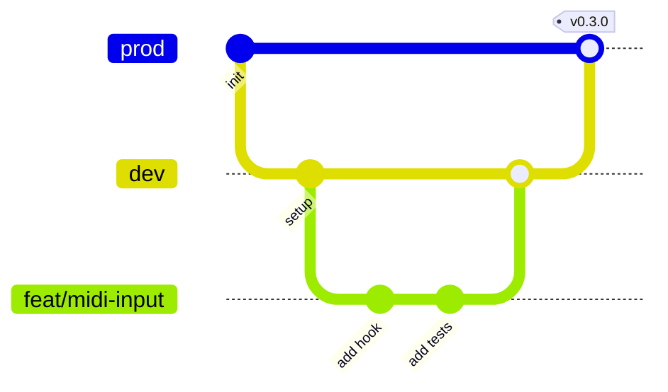

# Development guide

How to set up, work on, and ship changes, following the workflow most professional teams use.

---

## 1. Setup

**Requirements:** Node.js 22.12+ (24 recommended), npm, Git.

```bash
git clone https://github.com/satyaidk/expert-eureka.git
cd expert-eureka
npm install
npm run dev          # → http://localhost:3000
```

Recommended VS Code extensions: **ESLint**, **Tailwind CSS IntelliSense**, **Vitest**.

## 2. Everyday commands

| Command | When |
| --- | --- |
| `npm run dev` | Building features (hot reload) |
| `npm run test:watch` | Writing tests |
| `npm run validate` | **Before every commit/PR.** Lint, typecheck, tests, build |
| `npm run build && npm start` | Checking the production build |

## 3. Git workflow

| Branch | Purpose |
| --- | --- |
| `prod` | Deployed, always stable |
| `dev` | Integration branch; features land here first |
| `feat/…`, `fix/…`, `docs/…` | Short-lived work branches |

```bash
git switch dev && git pull
git switch -c feat/midi-input
# …code, test, commit…
npm run validate
git push -u origin feat/midi-input     # open a Pull Request into dev
```



### Commit messages: Conventional Commits

```
<type>(<scope>): <summary in present tense>
```

| Type | Example |
| --- | --- |
| `feat` | `feat(metronome): add tap tempo` |
| `fix` | `fix(input): match keys by physical code so Shift can't change notes` |
| `docs` | `docs: add ADR for lookahead scheduling` |
| `test` | `test(note-tracker): cover sostenuto with sustain` |
| `refactor` | `refactor(audio): extract createVoice from the engine` |
| `style` / `chore` / `ci` | formatting / tooling and deps / pipeline |

### Pull requests

Describe **what** changed, **why**, **how to test**, and add a **screenshot or GIF** for UI changes. CI must be green before merging.

## 4. Code conventions

### Naming

| Thing | Convention | Example |
| --- | --- | --- |
| Components | `PascalCase.tsx`, default export | `PedalUnit.tsx` |
| Hooks | `useCamelCase.ts`, named export | `useMetronome.ts` |
| Library modules | `kebab-case.ts`, named exports | `synth-voice.ts` |
| Tests | next to the file: `name.test.ts(x)` | `tuning.test.ts` |
| Constants | `UPPER_SNAKE_CASE` | `MAX_POLYPHONY` |
| Callback props / handlers | `onX` / `handleX` | `onNoteOn` / `handlePointerDown` |

### Where new code goes

| Adding… | Put it in |
| --- | --- |
| Music math, tuning, key layout | `src/lib/music/` |
| Synthesis, effects, scheduling | `src/lib/audio/` |
| Rules with no React or audio (like the pedal tracker) | `src/lib/` |
| State, effects, event listeners | `src/hooks/` |
| Keyboard visuals | `src/components/piano/` |
| A control-panel page or readout | `src/components/console/` (+ `panels/`) |
| A reusable control (button, knob, toggle) | `src/components/ui/` |
| A shared data shape | `src/types/index.ts` |
| A tunable number | `src/lib/constants.ts` |
| A design token (color, font) | `src/app/globals.css` (`:root` + `@theme inline`) |

### Style rules

- **TypeScript strict**, no `any`
- **`@/` imports**, except siblings (`./PianoKey`)
- **`'use client'`** only where needed
- **Comments explain *why*.** Every file starts with a `@fileoverview`
- **Accessibility is required**: labelled controls, keyboard support, roles and states. Build new controls from `components/ui/`
- **Validate at the boundary**: settings changes go through `updateSettings` → `sanitizeSettings`
- **No magic numbers**: add a named constant
- **Design language**: amber is the only accent; motion answers user actions ([ADR 0011](./decisions/0011-instrument-as-interface.md))

## 5. Walkthroughs

### Adding a voice (data only)

1. Add an id to `VoiceId` in `types/index.ts`
2. Add a recipe to `VOICES` in `lib/audio/voices.ts` (see [Part 3](./code-walkthrough/03-audio.md))
3. Update the voice count in `voices.test.ts`; the recipe is validated automatically
4. It appears on the Voice page, the layer and split pickers, and the LCD with no UI changes

### Adding a function page (a full feature)

Example: **damper resonance** (subtle sympathetic ringing while sustain is down).

1. **Constants**: resonance level and filter values in `constants.ts`
2. **Engine**: an `AudioEngine.setResonance(level)` and the extra node chain; test it with the fake AudioContext
3. **Settings**: add `resonance: number` to `PianoSettings`, a default in `settings.ts`, clamping in `sanitizeSettings` (+ test)
4. **Hook**: an effect in `usePiano` syncing `settings.resonance` to the engine
5. **UI**: a `Knob` in `SoundPanel`; light the Sound tab LED when it isn't default
6. **Tests**: engine, settings, and a component test
7. **Docs**: walkthrough sections, CHANGELOG, an ADR if there was a real trade-off
8. `npm run validate` → commit → PR

Bottom-up through the layers, with a test at each level.

## 6. Debugging tips

| Problem | Try |
| --- | --- |
| No sound | Click or press a key first (autoplay policy); check OS volume; DevTools Console |
| Stuck note | Write a failing test in `usePiano.test.tsx` or `note-tracker.test.ts` that reproduces it |
| Clicks or distortion | Chrome DevTools → **WebAudio** panel shows node count and context state; check the compressor and polyphony |
| Uneven metronome | It's scheduled on the audio clock; check the tab isn't throttled in the background |
| Too many re-renders | React DevTools Profiler → "Highlight updates" |
| Test can't find an element | `screen.debug()`; animated pages need `await findBy…` |

## 7. Deploying

[Vercel](https://vercel.com) (free for personal projects):

1. Push the repo to GitHub
2. Import it at vercel.com/new; set `prod` as the production branch
3. Every push to `prod` deploys; every PR gets a preview URL

Then put the live link at the top of the README.
