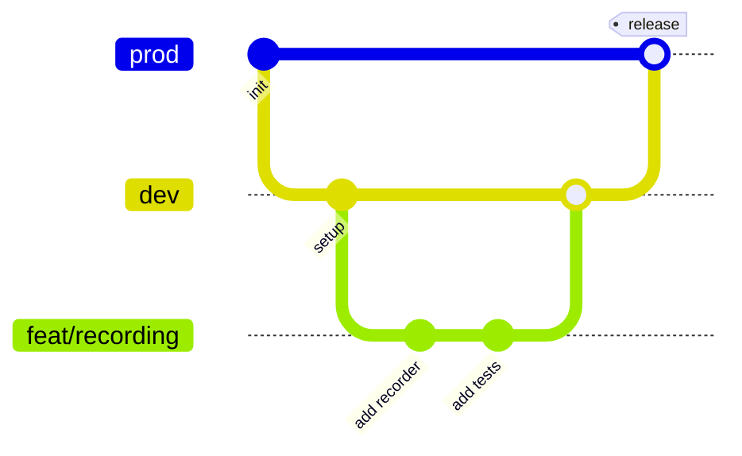

# Development guide

How to set up, work on, and ship changes to this project, following the workflow most professional teams use.

---

## 1. Setup

**Requirements:** Node.js 22.12 or newer (24 recommended), npm, Git.

```bash
git clone https://github.com/satyaidk/expert-eureka.git
cd expert-eureka
npm install
npm run dev          # → http://localhost:3000
```

Recommended VS Code extensions: **ESLint**, **Tailwind CSS IntelliSense**, **Vitest**.

## 2. Everyday commands

| Command | Use it when |
| --- | --- |
| `npm run dev` | Building features (hot reload) |
| `npm run test:watch` | Writing tests (re-runs on save) |
| `npm run validate` | **Before every commit/PR.** Lint, typecheck, tests, build |
| `npm run build && npm start` | Checking the production build locally |

## 3. Git workflow

The repository uses two long-lived branches:

| Branch | Purpose |
| --- | --- |
| `prod` | What's deployed. Always stable |
| `dev` | Integration branch. Features land here first |

Work happens on short-lived **feature branches**:

```bash
git switch dev && git pull                 # start from the latest dev
git switch -c feat/recording               # one branch per feature or fix
# …code, test, commit…
npm run validate                           # everything green?
git push -u origin feat/recording          # then open a Pull Request into dev
```



### Commit messages: Conventional Commits

```
<type>(<optional scope>): <short summary in present tense>
```

| Type | For | Example |
| --- | --- | --- |
| `feat` | New feature | `feat(piano): add recording and playback` |
| `fix` | Bug fix | `fix(audio): release notes replayed during fade` |
| `docs` | Documentation | `docs: explain ADSR envelope` |
| `test` | Tests only | `test(usePiano): cover window blur` |
| `refactor` | Code change, same behavior | `refactor: extract NowPlaying component` |
| `style` | Formatting, no logic change | `style: sort imports` |
| `chore` | Tooling, deps, config | `chore: add vitest` |
| `ci` | CI pipeline | `ci: cache npm in GitHub Actions` |

Small, focused commits with clear messages make history readable, and recruiters *do* look at commit history.

### Pull requests

A good PR description has:

1. **What** changed (one paragraph)
2. **Why** (link the issue or explain the problem)
3. **How to test** (steps a reviewer can follow)
4. **Screenshots / GIF** for UI changes

CI must be green before merging.

## 4. Code conventions

### Files and naming

| Thing | Convention | Example |
| --- | --- | --- |
| Components | `PascalCase.tsx`, default export | `PianoKey.tsx` |
| Hooks | `useCamelCase.ts`, named export | `usePiano.ts` |
| Library modules | `kebab-case.ts` or `camelCase.ts`, named exports | `audio-engine.ts` |
| Tests | Next to the file: `name.test.ts(x)` | `notes.test.ts` |
| Constants | `UPPER_SNAKE_CASE` | `MAX_OCTAVE_SHIFT` |
| Event handler props | `on…` | `onNoteStart` |
| Handler implementations | `handle…` | `handleNoteStart` |

### Where new code goes

| You're adding… | Put it in |
| --- | --- |
| Music math, audio, pure helpers (no React) | `src/lib/` |
| Stateful logic, effects, event listeners | `src/hooks/` |
| A visual piece of the keyboard | `src/components/piano/` |
| A new control | `src/components/controls/` |
| Page chrome (header, footer, providers) | `src/components/layout/` |
| A shape used by several files | `src/types/index.ts` |
| A tunable number | `src/lib/constants.ts` |

### Style rules

- **TypeScript strict.** Avoid `any`; describe data with interfaces
- **Imports via the `@/` alias**, except siblings in the same folder (`./PianoKey`)
- **`'use client'`** only on files that need the browser
- **Comments explain *why*, not *what*.** Every file starts with a `@fileoverview` block
- **Accessibility is not optional.** Buttons get labels, inputs get `<label>`s, and new interactions must work by keyboard
- **No magic numbers.** Add a named constant

## 5. Walkthrough: adding a feature end-to-end

Example: **a "waveform" selector** (piano / organ / retro).

1. **Types.** Add `waveform: 'piano' | 'organ' | 'retro'` to `PianoConfig` in `types/index.ts`
2. **Constants.** Define harmonic amplitudes per waveform in `constants.ts`
3. **Engine.** Add `setWaveform()` to `AudioEngine`; use the selected amplitudes in `playNote`
4. **Test the engine.** In `audio-engine.test.ts`, assert the harmonic gains change
5. **Hook.** Add `handleWaveformChange` to `usePiano`, calling the engine through `useAudioEngine`
6. **UI.** Add a `WaveformSelect.tsx` in `components/controls/` and render it in `ControlPanel`
7. **Test the UI.** Selecting an option calls the handler
8. **Docs.** Update the code walkthrough; write an ADR if you made a notable trade-off
9. `npm run validate` → commit → PR

Notice the order: **bottom-up through the layers**, with a test at each level.

## 6. Debugging tips

| Problem | Try |
| --- | --- |
| No sound | Click the page first (autoplay policy); check the OS volume; open DevTools → Console for errors |
| Note stuck on | Note what you pressed, then write a failing test that reproduces it in `usePiano.test.tsx` |
| Component re-renders too much | React DevTools → Profiler → "Highlight updates when components render" |
| Audio graph questions | Chrome DevTools → **WebAudio** panel shows the live context state and node count |
| A test fails mysteriously | Run it alone: `npx vitest run -t "test name"`; add `screen.debug()` to print the DOM |
| Types confusing | Hover the variable in VS Code; `npm run typecheck` for the full list |

## 7. Deploying

The easiest host for Next.js is [Vercel](https://vercel.com) (free for personal projects):

1. Push the repo to GitHub
2. Import it at vercel.com/new and pick the `prod` branch as the production branch
3. Every push to `prod` deploys; every PR gets its own preview URL

Add the live URL to the README and your resume. **A link people can click beats a description every time.**
